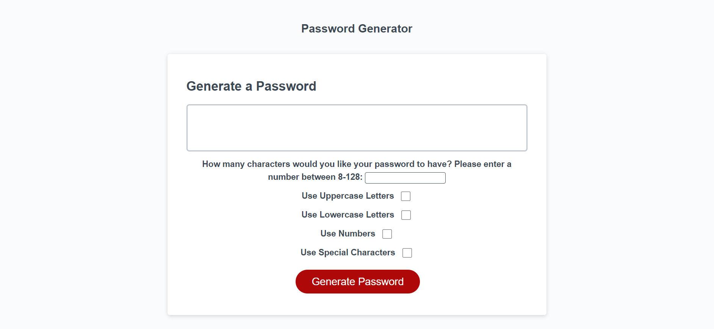

# Simple Password Generator

## Purpose
Simple password generator to make it easy for a user so come up with random passwords. The user can select from four 
character types: uppercase letters, lowercase letters, numbers, and special characters. The user can also select how many 
digits will be in their password (between 8-128).

## Built With
* HTML
* CSS
* JavaScript

## Website
You can visit the application here: [Password Generator](https://samvrny.github.io/simple-password-generator/)

Here is a look at the finished webpage:

## Contribution
Made by Samuel Varney
