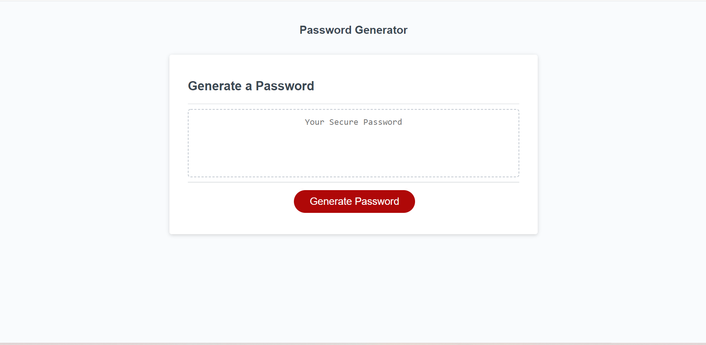

# A Simple Password Generator

## Purpose
This is a simple password generator that can be used to come up with hard to crack passwords using any combination of upper or lower case letters, numbers, and special characters. The user only has to select which characters they would like to use and the length of their password, and the generator will give them the results based on their inputs!

## Built With
* HTML
* CSS
* JavaScript

## Website

https://samvrny.github.io/a-simple-password-generator/

## Contribution
Made by Samuel Varney